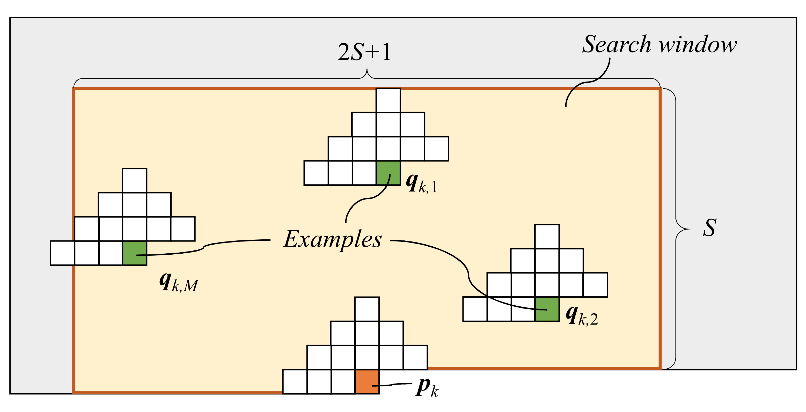
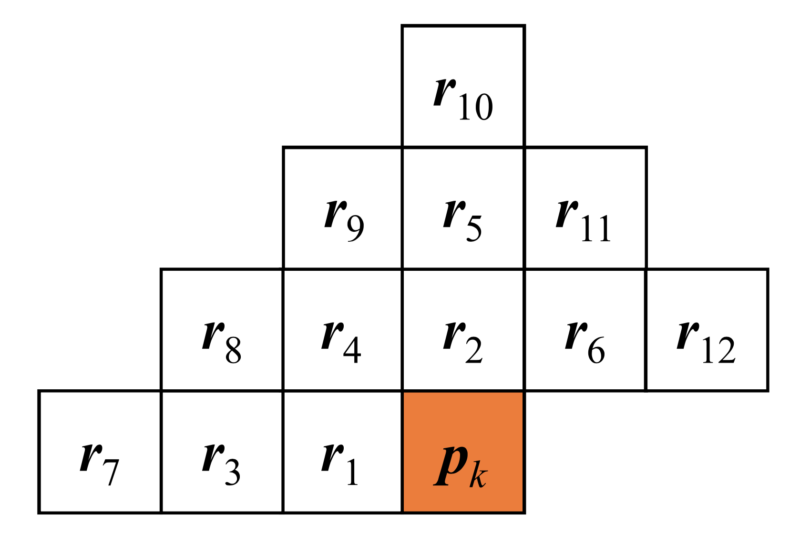
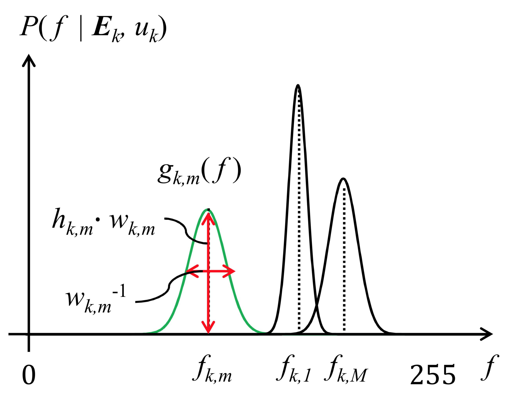
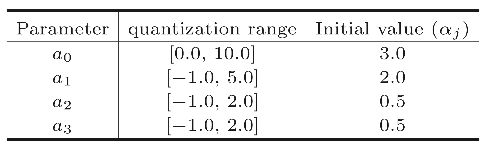

# 事例探索と確率モデルの最適化に基づく可逆符号化方式

### 事例探索

| 変数名                                                              | 意味                                                           |
|:-------------------------------------------------------------------:|:---------------------------------------------------------------|
| $\mathbb{Z}^2$                                                      | 画素の平面（整数の平面）                                       |
| $\bm{p}_k \in \mathbb{Z}^2$                                         | 符号化対象画素                                                 |
| $S$                                                                 | 探索窓の大きさを制御するパラメータ                             |
| $\bm{r}_i \in \mathbb{Z}^2$                                         | $\bm{p}_k$ を基準とした位置ベクトル                            |
| $\Vert\bm{r}_i\Vert_1$                                              | 符号化対象画素との市街地距離                                   |
| $\{ \bm{p}_k + \bm{r}_i \vert i = 1, 2, \dots, 12 \}$               | $\Vert\bm{r}_i\Vert_1 \le 3$ を満たす12画素                    |
| $\bm{q} \in \mathbb{Z}^2$                                           | 探索領域内の全ての画素                                         |
| $J_k(\bm{q})$                                                       | **式(1)** : 周辺輝度分布とテンプレートの類似度を示すコスト関数 |
| $f(\bm{q})$                                                         | 画素 $\bm{q}$ の輝度値                                         |
| $\mu(\bm{q})$                                                       | **式(2)** : テンプレート内の輝度値の重み付き平均               |
| $w_i$                                                               | **式(3)** : $\sigma_t = 1.25$ のガウス関数で定義された重み係数 |
| $\bm{E}_k = \{ \bm{q}_{k,1},  \bm{q}_{k,2}, \dots \bm{q}_{k,M}, \}$ | 式(1)のコストが小さい順に $M$ 画素を抽出した事例の集合         |
| $f_{k, m}$                                                          | **式(4)** : 符号化対象画素の輝度値に関する推定値（ $M$ 種類）  |

$$
J_k (\bm{q}) 
= \left[ \sum_{i = 1}^{12} w_i \cdot \left(
f( \bm{q} + \bm{r}_i ) - \mu(\bm{q}) - f(\bm{p}_k + \bm{r}_i ) + \mu(\bm{p}_k)
\right)^2 \right]^{\dfrac{1}{2}}
+ \lambda_d \cdot \Vert \bm{q} - \bm{p}_k \Vert_1
\tag{1}
$$

$$
\mu(\bm{q}) = \sum_{i = 1}^{12} w_i \cdot f(\bm{q} + \bm{r}_i) \tag{2}
$$

$$
w_i = \dfrac{
\exp\left( -\dfrac{1}{2} \Vert \bm{r}_i \Vert_1^2 / \sigma_t^2 \right)
}{
\sum_{l = 2}^{12}\exp\left( -\dfrac{1}{2} \Vert \bm{r}_l \Vert_1^2 / \sigma_t^2 \right)
}
\tag{3}
$$

$$
f_{k, m} = f(\bm{q}_{k, m}) - \mu(\bm{q}_{k, m}) + \mu(\bm{p}_{k}) \qquad ( m = 1, 2, \dots, M ) \tag{4}
$$

### 確率分布の最適化

| 変数名                                            | 意味                                                                                                             |
|:-------------------------------------------------:|:-----------------------------------------------------------------------------------------------------------------|
| $f(\bm p_k)$                                      | 符号化対象画素の輝度値                                                                                           |
| $f \quad (\approx f_{k,m})$                       | $f(\bm p_k)$ の取りうる値（括弧内は $J_k(\bm q_{k, m})$ が十分に小さい時）                                       |
| $\mathrm{Pr}(f \vert \bm E_k, u_k)$               | **式(5)** : $\bm E_k$ が与えられた時の $f$ の確率                                                                |
| $P(f \vert \bm E_k, u_k)$                         | ガウス関数の和 ＋ 正定数                                                                                         |
| $\epsilon = 2^{-20}$                              | 確率が0になることを避けるための正定数                                                                            |
| $g_{k,m}(f)$                                      | **式(6)** : ガウス関数                                                                                           |
| $h_{k,m}$                                         | **式(7)** : ガウス関数の高さを制御するパラメータ（ $d_{k,m}$ に依存すると考える）                                |
| $d_{k, m}$                                        | **式(8)** : 信頼度 ＝ 事例 $\bm q_{k,m}$ のテンプレートマッチングのコスト                                        |
| $w_{k, m}$                                        | **式(9)** : ガウス関数の幅を制御するパラメータ（ $d_{k, m}$ と $u_k$ に依存すると考える）                        |
| $\{ a_j \vert j= 0, \dots, 3 \}$                  | モデルパラメータ                                                                                                 |
| $\mathrm{Pr}(f(\bm p_k) \vert \bm E_k , u_k)$     | **式(10)** : 符号化対象画素の輝度値 $f(\bm p_k)$ の生起確率（式(5)を正規化）                                     |
| $L(\bm p_k)$                                      | **式(11)** : $f(\bm p_k)$ エントロピー符号化した際の見積もり符号量（式(10) の確率分布で）                        |
| $u_k$                                             | **式(12)** : 画素 $p_k$ での符号化済みの近傍画素における確率モデルの適合度を表す特徴量                           |
| $J(\mathbb\Omega)$                                | **式(13)** : ある領域 $\mathbb\Omega$ 内で最終的な符号量を最小にするモデルパラメータの最適化問題における目的関数 |
| $\dfrac{\partial}{\partial a_j}J_(\mathbb\Omega)$ | **式(14)** : $J(\mathbb\Omega)$ の各モデルパラメータに対する勾配成分                                             |

$$
\mathrm{Pr}(f \vert \bm{E_k, u_k}) \propto P(f \vert \bm{E_k, u_k}) = \sum_{m=1}^M g_{k, m}(f) + \epsilon \tag{5}
$$

$$
g_{k, m}(f) = h_{k, m} \cdot w_{k, m} \cdot \exp \left( -w_{k, m}^2 \cdot (f-f_{k, m})^2 \right) \tag{6}
$$

$$
h_{k, m} = \exp(-a_1 \cdot d_{k, m}) \tag{7}
$$

$$
d_{k, m} = J_k (\bm{q}_{k, m}) \tag{8}
$$

$$
w_{k, m} = a_0 \cdot \exp ( -a_2 \cdot d_{k, m} ) \cdot \exp ( -a_3 \cdot u_k ) \tag{9}
$$

$$
\mathrm{Pr}(f(\bm{p}_k) \vert \bm{E}_k, u_k) = \dfrac{
P(f(\bm{p}_k) | \bm{E}_{k}, u_k)
}{
\sum_{f=0}^{255} P(f | \bm{E}_{k}, u_k)
} \tag{10}
$$

$$
\begin{aligned}
L(\bm{p}_k)
&= -\log_2 \mathrm{Pr}(f(\bm{p}_k) | \bm{E}_k, u_k)\\[3mm]
&= \frac{1}{\ln 2} \left[ \ln \left( \sum_{f=0}^{255} P(f | \bm{E}_k, u_k) \right) - \ln P(f(\bm{p}_k) | \bm{E}_k, u_k) \right]
\end{aligned}\tag{11}
$$

$$
u_k = \sum_{i=1}^{12} w_i \cdot L(\bm p_k + \bm r_i) \tag{12}
$$

$$
J(\mathbf\Omega) = \sum_{\bm p_k  \in \mathbf\Omega} L(\bm p_k) + \lambda_p \sum_{j=0}^3 (a_j - \alpha_j)^2 \tag{13}
$$

$$
\frac{\partial}{\partial a_j} J_(\mathbf \Omega)
= \frac{1}{\ln 2} \sum_{\bm p_k \in \mathbf \Omega } \left(
    \frac{\sum_{f=0}^{255}\frac{\partial}{\partial a_j}P(f | \bm E_k, u_k)}{\sum_{f=0}^{255}P(f | \bm E_k, u_k)}
    - \frac{\frac{\partial}{\partial a_j}P(f | \bm E_k, u_k)}{P(f | \bm E_k, u_k)}
\right) + 2\lambda_p(a_j - \alpha_j)
\tag{14}
$$

